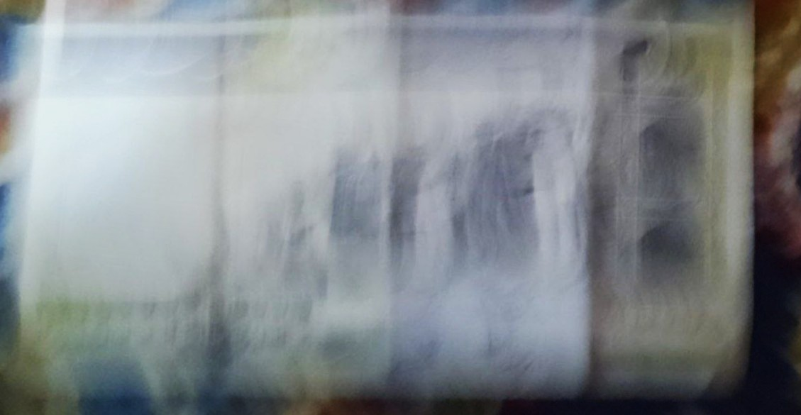

# Iranian Banknote Detection System

## Overview

This computer vision project implements a robust image recognition system for detecting and matching Iranian banknotes using the powerful ORB (Oriented FAST and Rotated BRIEF) feature detection algorithm.


## 🚀 Key Features

- **High Accuracy**: Achieved **98.86%** detection rate on test dataset
- **Blazing Fast Processing**: Processes 88 images in just **5 seconds** (20 seconds with visualization)
- **Multi-Threaded Processing**: Utilizes concurrent processing for efficient image analysis
- **Flexible Feature Matching**: Uses ORB algorithm for reliable feature extraction
- **Adaptive Image Preprocessing**: Handles variations in image quality and lighting
- **Generalized Design**: Can be adapted for detecting various types of images, not just banknotes

## 📊 Performance Metrics

- **Total Test Images**: 88
- **Correctly Detected**: 87
- **Accuracy**: 98.86%

## Why One Image Wasn't Detected?

The undetected image (`500_20.jpg`) is a great example of the system's realistic limitations:



This image was challenging due to:
- blur
- Poor image quality
- camera shake
- Low contrast

## 🛠 Installation

```bash
git clone https://github.com/yourusername/banknote-detector.git
cd banknote-detector

# Recommended: Create a virtual environment
python -m venv venv
source venv/bin/activate  # On Windows, use `venv\Scripts\activate`

# Install dependencies
pip install -r requirements.txt
```

## How It Works

1. **Reference Image Loading**: Loads reference banknote images from a training dataset
2. **Feature Extraction**: Uses ORB to detect and compute features
3. **Image Preprocessing**: 
   - Resizes images
   - Applies Gaussian blur
   - Enhances contrast with CLAHE
4. **Feature Matching**: 
   - Uses brute-force matcher
   - Applies ratio test for robust matching
5. **Homography Estimation**: Determines best image match using RANSAC

## Usage

```python
from banknote_detector import BanknoteDetector

# Initialize detector with reference images
detector = BanknoteDetector('./train')

# Detect banknote in a test image
result_image, match_index, filename = detector.detect_banknote(test_image)
```

## Detailed Algorithm

### Feature Detection
- **Algorithm**: ORB (Oriented FAST and Rotated BRIEF)
- **Key Parameters**:
  - 1000 features
  - 12 scale levels
  - Harris corner score
  - Fast threshold: 20

### Matching Strategy
- Brute-force matching
- Ratio test (0.75) for robust feature correspondence
- RANSAC for outlier rejection

## 🌟 Contributing

1. Fork the repository
2. Create your feature branch (`git checkout -b feature/AmazingFeature`)
3. Commit your changes (`git commit -m 'Add some AmazingFeature'`)
4. Push to the branch (`git push origin feature/AmazingFeature`)
5. Open a Pull Request

## License

Distributed under the MIT License. See `LICENSE` for more information.

## Acknowledgments

- OpenCV Community
- Banknote dataset contributors
- Python Concurrent Futures library

## Contact

Soroush Ebrahimi - [ebrahimicro@gmail.com]

Project Link: [https://github.com/Soroushcro/banknote-detector](https://github.com/Soroushcro/banknote-detector)